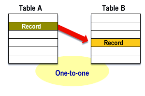
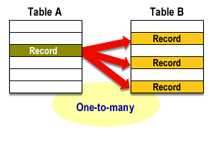
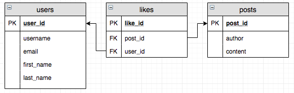

# Schemas and relationships
- What is a schema and why/when would you need one?
- What are primary keys and why do we need them?
- Create a visual representation of a mock schema for a database about GSG code Academy, using as many different kinds of relationship as you can. Explain the logic behind it.

## Database Schema 🗂️
Database schema is the description of database, specifies how data is arranged in a relational database, including logical constraints such as table names, fields, data types, and the relationships between these entities.

### Why we need database schema 🤓
- Structured data: A database schema allows you to structure your data in a logical and organized manner. This makes it easier to retrieve, manipulate, and analyze data within the database.

- Data consistency and accuracy: By defining the data types and constraints within the schema, you can ensure that the data stored in the database is consistent and accurate. This reduces the risk of errors and inconsistencies in the data.

- Data integrity: The schema can define relationships between tables and enforce constraints on the data. This ensures that the data in the database is reliable and consistent.

### When we need database schema 🤔
A database schema is used when you are designing or developing a relational database. It's an essential component of the database development process because it defines the structure, organization, and relationships of the data within the database.

## Database Relationships 🔗

Relationships are meaningful associations between tables that contain related information, they’re what make databases useful.

### Types of Relationships

- One-to-one

  

- One-to-many

  
  
- Many-to-many

  A many-to-many relationship indicates that multiple records in a table are linked to multiple records in another table.

  
  ### Primary Key 🔑

  ### What is a Primary Key?👀
  At its most basic level, a primary key is a special column or combination of columns in a relational database table that is designated to uniquely identify each record within the table. This means that each record within the table must have a unique primary key value.
  ```sql
  CREATE TABLE Persons (
    ID int NOT NULL,
    LastName varchar(255) NOT NULL,
    FirstName varchar(255),
    Age int,
    CONSTRAINT PK_Person PRIMARY KEY (ID,LastName)
    );


### Why is a Primary Key Important?🤓
- It allows for quick and efficient data retrieval within the table. When you query the table using the primary key, the database can quickly locate the record associated with that key, without having to search through the entire table.

- The primary key ensures that each record within the table is unique. This is important for data integrity, as it prevents duplicate records from being created within the table.

- The primary key is often used in conjunction with foreign keys to establish relationships between tables. This allows for complex queries and data analysis to be performed across multiple tables within the database.

### Conclusion
The primary key is a critical concept in the design and implementation of relational databases. It serves as a unique identifier for each record within a table, and allows for quick and efficient data retrieval and analysis. By understanding the importance of primary keys, you can ensure that your relational database functions effectively and efficiently.

- PK & FK in relations

 
